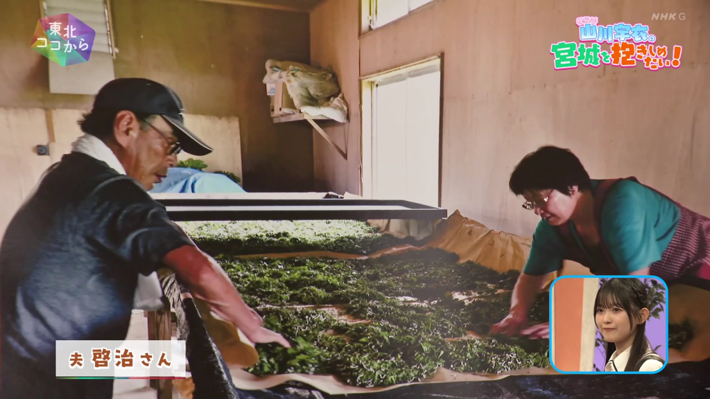

# OCR 为什么对人名有用

测试素材为《東北ココから》2026-09-18 节目的 17:28–17:53 片段。声音中的「けいじ」无法唯一确定汉字；既有 ASR 合并结果同时出现了「けいじさん」和「慶次さん」，而画面名条写的是「啓治」。

## 对照方式

复用同一份既有 ASR/合并结果，两个方案都把全片 309 行日文交给 pre-pass，使用相同模型配置。截取片段仅用于展示与翻译对比，不将三行片段当作全部节目上下文。

| 步骤 | 无 OCR | 有 OCR |
|---|---|---|
| 画面文字 | 未提供 | Apple Vision 实际读出 `夫啓治さん` |
| Jev | 无输入 | 分类为 `person_name` |
| 自动词库 | `けいじさん -> 目黒慶次` | `けいじ -> 目黒啓治` |
| 对应中文姓名 | 慶次桑 | 啓治桑 |

OCR 并非绝对准确：同帧还把山川宇衣读成了「山川字衣」，需要全片上下文辅助归并。最初仅使用三行上下文时，测试出现了人物错误关联；改用项目设计要求的全文上下文后，本次人物关联恢复正常。因此应同时检查文字准确性和人物关系，不能把 Jev 的实体分类置信度当成 OCR 识别置信度。

## 执行方式

1. 从自己的测试视频抽取出现人名条的帧，用外部 OCR 工具生成 observation JSON。
2. 在同一段 ASR/合并文本和模型设置下，一次不传 OCR，一次通过 `--ocr-json` 传入；分别使用独立输出目录或保存输出快照，避免覆盖对照。
3. 比较 `glossary.md` 及 `out_zh.srt`，同时保留 OCR 原文、分类结果和 pre-pass 的待核对项。
4. 通过新导出的 `out_ja_zh.srt` 对照校对。视觉词库影响翻译，日文仍保留 ASR/合并原文，不能把它当成已修正的日文稿。

此示例验证画面线索的价值，不代表其他姓名或字幕已经完全正确。OCR 引擎仍由外部工具提供，maijev 负责接收文字、筛选、整理词库并注入翻译。
